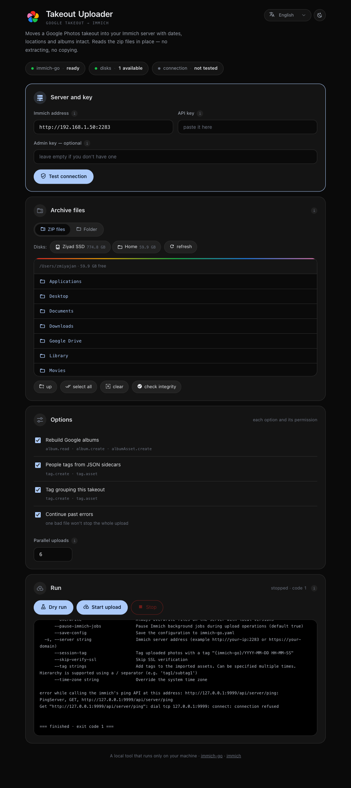
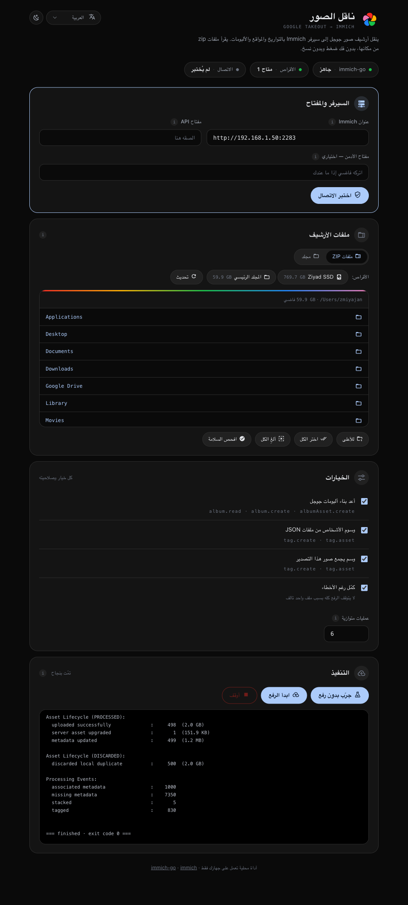

<div align="center">


# Immich Takeout Uploader

**Import a Google Photos takeout into your own Immich server — with dates, locations and albums intact.**

One Python file. No dependencies, no install step, no Docker.

Available in English, العربية, Español, Français, Deutsch, Português and 中文.

</div>

---

## Why this exists

[`immich-go`](https://github.com/simulot/immich-go) does the actual importing, and it does it well. Driving it correctly, though, means remembering a long command line and a handful of flags that fail in quiet, expensive ways when you get them wrong:

- **Every part must go in a single run.** Google splits a takeout by size, not by logic, so a photo lands in one zip part while its JSON sidecar — holding the date, GPS and album — lands in another. Upload the parts one at a time and every photo whose sidecar is missing is **rejected outright**, not merely stripped of metadata.
- **A truncated archive fails silently.** Takeout links expire, and an expired link serves an HTML error page that lands on disk with a `.zip` name. You find out hours into an upload.
- **Several default flags need permissions a least-privilege key may not have.** `--sync-albums`, `--people-tag` and `--takeout-tag` are all on by default and will return 403 mid-run.
- **Scratch files default to the system disk**, which is usually the one without room.

This tool is a small local web UI that gets those four things right by construction, and shows you the live log while it runs.

## What it does

| | |
|---|---|
| **Reads archives in place** | No extracting, no copying. A 1 TB takeout needs 1 TB of space, not 2. |
| **Checks integrity first** | Reads each archive's central directory — fast even on a 50 GB part — and catches truncated files before an upload is wasted on them. |
| **Verifies permissions up front** | Calls the endpoints `immich-go` will use and names the exact scope that is missing, before anything is transferred. |
| **Keeps scratch files off the system disk** | Points `IMMICHGO_TEMPDIR` at the same volume as the archives. |
| **Won't let the machine sleep** | Wraps the run in `caffeinate` on macOS. |
| **Takes zips or a folder** | Either the numbered zip parts or one already extracted takeout directory. |
| **Themed to match Immich** | Light and dark, following Immich's own colour tokens. |
| **Installs immich-go for you** | Detects your OS and CPU and fetches the matching release, so Python is the only prerequisite. |
| **Every immich-go flag** | Content filters, RAW/HEIC/burst grouping, tags, date ranges and timeouts, each labelled with the flag it sets. |
| **Presets from the upstream guide** | Four configurations matching what immich-go recommends for small, medium, large and slow-network imports. |

## Install

One file, one command:

```bash
curl -fsSLO https://raw.githubusercontent.com/zmiyajan/immich-takeout-uploader/main/app.py && python3 app.py
```

That downloads the app and opens <http://127.0.0.1:8765>. Nothing is installed system-wide and nothing is hidden — you can read `app.py` before running it.

If you would rather it live in its own folder with a double-clickable launcher:

```bash
curl -fsSL https://raw.githubusercontent.com/zmiyajan/immich-takeout-uploader/main/install.sh | sh
```

Piping a script into a shell means trusting it unread; the one-file command above does the same job and lets you inspect it first.

Or clone it:

```bash
git clone https://github.com/zmiyajan/immich-takeout-uploader.git
cd immich-takeout-uploader && python3 app.py
```

Work through four steps: server → files → options → run. Set `IG_PORT` for a different port.

## Requirements

**Python 3.6 or newer.** That's the whole list — macOS and every mainstream Linux distribution already ship it.

`immich-go` is fetched by the app itself: if it isn't on the machine, the first screen offers an install button that downloads the release matching your OS and CPU into `~/.local/bin`. Downloading it that way also sidesteps the macOS quarantine flag that makes Gatekeeper kill a browser-downloaded binary on launch.

You'll also need a running Immich server and an API key, covered below.

> **The server binds to `127.0.0.1` only.** Your API key travels through this page, so it is never exposed to the network. To use it on a headless machine, tunnel rather than binding wider:
> ```bash
> ssh -N -L 8765:127.0.0.1:8765 user@your-server
> ```

## API key permissions

Nine scopes are enough to upload photos and rebuild albums. In Immich open **Account Settings → API Keys → New API Key**, then use the search box:

```
user.read          server.about       asset.read
asset.statistics   asset.upload       asset.update
album.read         album.create       albumAsset.create
```

Add `tag.create` and `tag.asset` if you want people tags. **Do not use "Select all"** — it grants delete and key-creation rights that importing never needs.

This list was derived by tracing every API call in `immich-go`'s upload path rather than copied from documentation.

The built-in connection test verifies **all** of them, including the write scopes, without creating anything. Read scopes are checked with a plain `GET`; write scopes get a request with a deliberately empty body, which Immich rejects during validation. Authorisation is checked before validation, so the status code is the answer: `403` means the scope is missing, while `400` means the scope is present and only the payload was refused.

An optional **admin key** carrying `job.create` and `job.read` lets `immich-go` pause Immich's background jobs during the import, which makes a real difference on small hardware. Without one the tool passes `--pause-immich-jobs=false` so the run does not 403.

## Running it on the server

Importing over `localhost` instead of Wi-Fi is dramatically faster. `deploy.sh` installs `immich-go`, copies the app across, and starts it so it survives an SSH disconnect:

```bash
./deploy.sh user@your-server
```

It also writes a `tunnel.command` you can double-click to open the UI from your laptop.

## macOS and external disks

macOS blocks Terminal from reading external volumes until you allow it. The symptom is a disk that reports its free space correctly but returns `Operation not permitted` when listed.

**System Settings → Privacy & Security → Full Disk Access → enable Terminal**, then quit and reopen it. The tool detects this state and says so.

## Screenshots

<div align="center">


</div>

<div align="center"><sub>English and Arabic. A light theme is included and follows the system setting by default.</sub></div>

## Every option is explained

Each switch and field carries an ⓘ that states its default, what changing it actually does, and the consequence — because a checkbox you don't understand is a checkbox you shouldn't have to gamble on.

Options that carry risk are labelled on the row itself, before you open anything:

| Badge | Meaning | Options |
|---|---|---|
| **changes what is imported** | Photos arrive that otherwise wouldn't, or arrive without metadata | trashed photos, photos with no JSON sidecar, untitled albums |
| **deletes data** | Removes something already on the server | replace photos already on the server |
| **security or privacy risk** | Weakens a check, or writes sensitive detail to disk | skip certificate check, log every API call |

Only one option in the whole tool deletes anything, and it is off by default and needs a scope the recommended key does not have.

Help text is written in English and Arabic. The other languages fall back to English per key, so a partial translation still leaves a usable interface.

## Adding a language

Translations live in one object near the top of the inline script in `app.py`:

```js
var LANGS = [["en","English"], ["ar","العربية"], ...];
var RTL   = ["ar"];
var TR    = { "en": { ... }, "ar": { ... } };
```

Copy the `en` block, translate the values, keep every key, then add the code and its native name to `LANGS` — and to `RTL` if the script runs right to left. Missing keys fall back to English, so a partial translation still produces a usable interface.

Values may contain `{placeholders}` that are substituted at runtime, and a few contain small HTML fragments; keep the tags as they are.

## Notes for contributors

`app.py` is generated as a single self-contained file so it can be cloned and run with nothing else installed. It embeds:

- the page markup, styles and script
- the interface strings for every language
- the Material Design Icons paths (the same set Immich uses)
- the Immich logo as inline SVG

Latin text inside right-to-left prose is wrapped in `<bdi>` so the surrounding punctuation does not reorder, and Arabic never inherits letter-spacing or a monospaced face, both of which break its cursive joins.

## License

MIT — see [LICENSE](LICENSE).

Not affiliated with the Immich or immich-go projects. The Immich logo belongs to the [Immich project](https://github.com/immich-app/immich).
